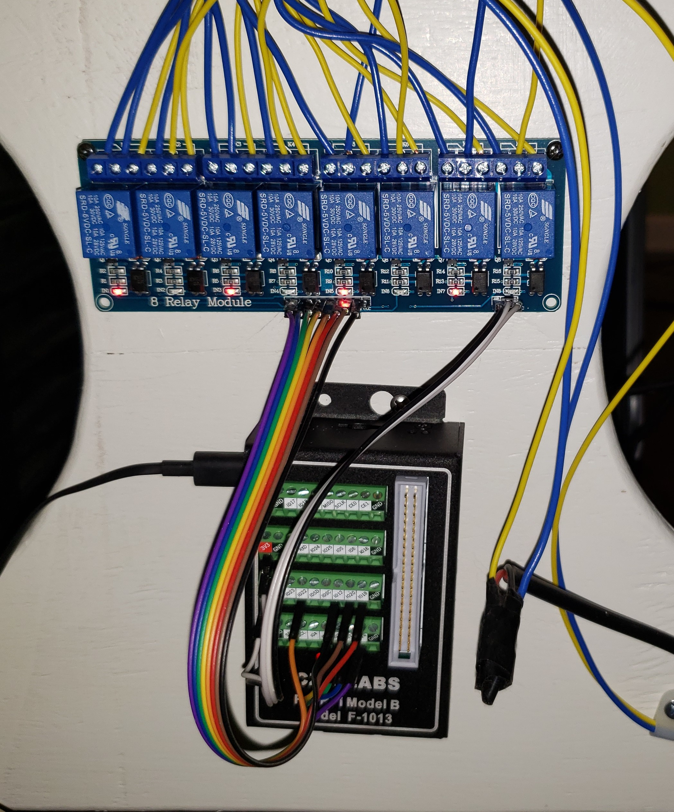

# Quad Actuator Standup Desk
## Summary
This project is a convertable office desk driven by four linear actuators with 18" of travel between the fully retracted and fully extended positions. When the desk is lowered, the top is 29.5" above the floor and 47" when raised. 
## Wiring 

An 8 relay board is used to control the 4 actuators. Actuators are in each of the four corners of the desk and are labeled front left, back left, back right, and front right.
 
A raspberry PI is used to control the 8 relays. 
